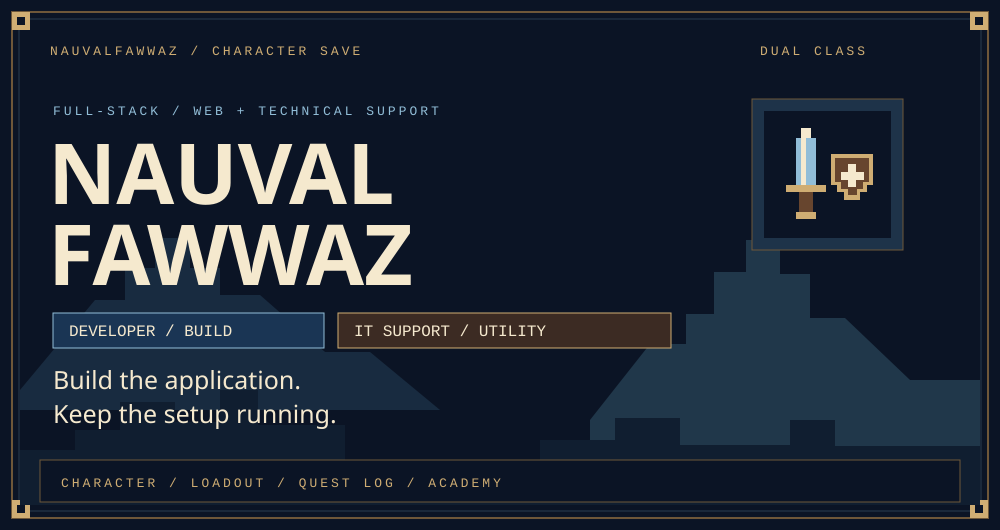
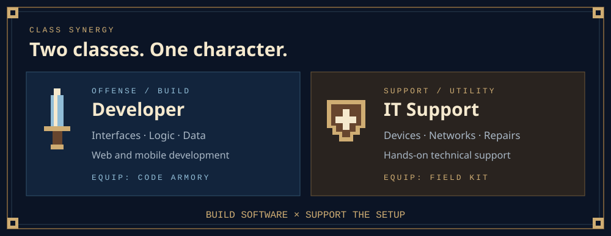
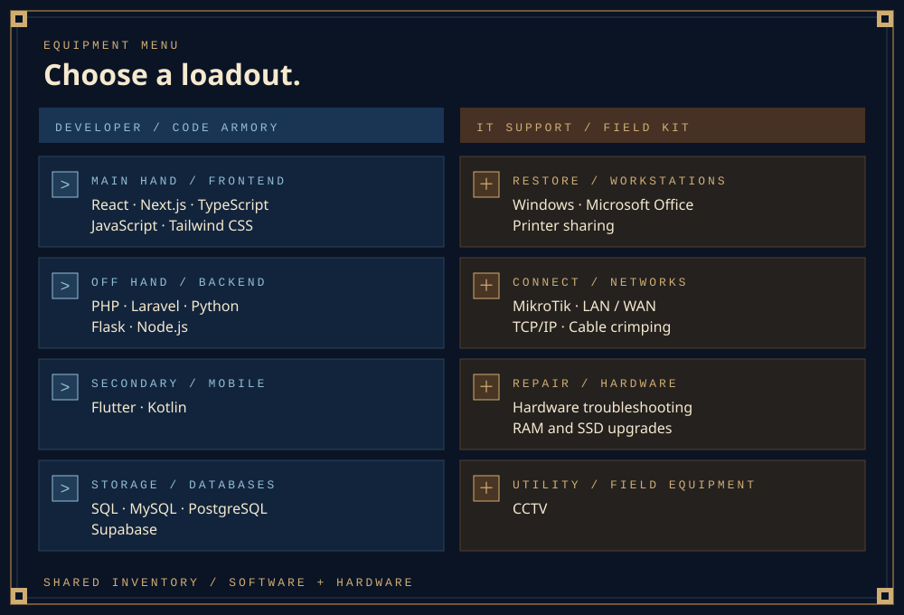
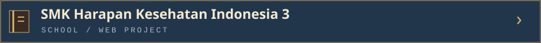
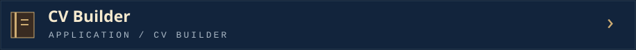
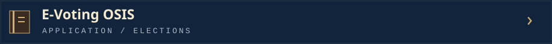
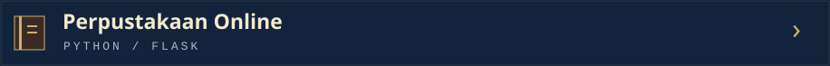
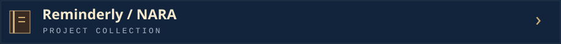
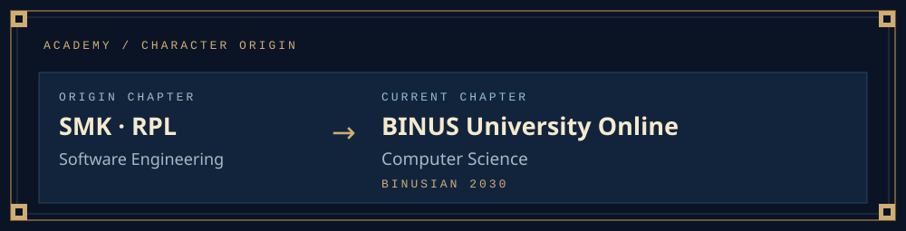
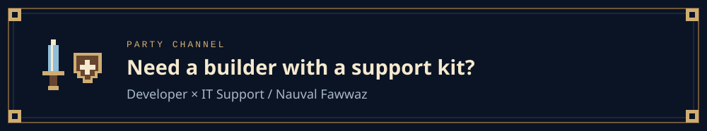

<!-- Upload README.md and the assets folder together to NauvalFawwaz/NauvalFawwaz. -->

<a href="#character"><kbd>Character</kbd></a> &nbsp; <a href="#loadout"><kbd>Equipment</kbd></a> &nbsp; <a href="#quests"><kbd>Quest log</kbd></a> &nbsp; <a href="#academy"><kbd>Academy</kbd></a> &nbsp; <a href="#party"><kbd>Party</kbd></a>

I'm <b>Nauval Fawwaz</b>, a Full-Stack / Web Developer and IT Support / Technician. I build applications and work with the devices and networks behind them.

<b>Inspect code armory</b> · Developer equipment

| Slot | Equipped tools |
| :--- | :--- |
| Main hand · Frontend | React, Next.js, TypeScript, JavaScript, Tailwind CSS |
| Off hand · Backend | PHP, Laravel, Python, Flask, Node.js |
| Secondary · Mobile | Flutter, Kotlin |
| Storage · Databases | SQL, MySQL, PostgreSQL, Supabase |

<b>Inspect field kit</b> · IT Support / Technician equipment

| Ability | Field skills |
| :--- | :--- |
| Restore | Windows, Microsoft Office, printer sharing |
| Connect | MikroTik, LAN/WAN, TCP/IP, cable crimping |
| Diagnose | Hardware troubleshooting |
| Upgrade | RAM and SSD upgrades |
| Utility | CCTV |

 

<h2 align="center">QUEST LOG / SELECT A PROJECT</h2>

<samp>Click a project card to open its journal. Click again to close.</samp>

A web project for **SMK Harapan Kesehatan Indonesia 3**.

<code>DEVELOPER CLASS</code> · <code>WEB PROJECT</code>

[Visit my portfolio](https://nauvalfawwaz.netlify.app/)

A CV-building application.

<code>DEVELOPER CLASS</code> · <code>APPLICATION</code>

[Browse my GitHub profile](https://github.com/NauvalFawwaz)

An electronic voting project for OSIS elections.

<code>DEVELOPER CLASS</code> · <code>WEB PROJECT</code>

[Browse my GitHub profile](https://github.com/NauvalFawwaz)

An online library project built with Flask.

<code>DEVELOPER CLASS</code> · <code>PYTHON / FLASK</code>

[Browse my GitHub profile](https://github.com/NauvalFawwaz)

**Reminderly / NARA**, part of my highlighted project collection.

<code>DEVELOPER CLASS</code> · <code>PROJECT JOURNAL</code>

[Visit my portfolio](https://nauvalfawwaz.netlify.app/)

 

<b>Read academy record</b> · Education

| Chapter | Education |
| :--- | :--- |
| Current | BINUS University Online · Computer Science · BINUSIAN 2030 |
| Origin | SMK · Rekayasa Perangkat Lunak (Software Engineering) |

 

Have a web project or a technical problem to discuss? Browse my work or connect with me on LinkedIn.

| World map | Code archive | Party chat |
| :---: | :---: | :---: |
| [Portfolio](https://nauvalfawwaz.netlify.app/) | [GitHub](https://github.com/NauvalFawwaz) | [LinkedIn](https://www.linkedin.com/in/nauval-fawwaz-fadlian-560083298) |

 
<samp>DEVELOPER × IT SUPPORT · SAME SAVE FILE.</samp>
  
<a href="#character"><kbd>Return to character</kbd></a>

